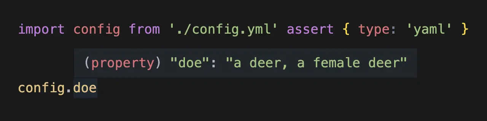
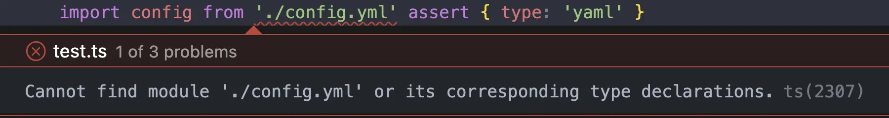
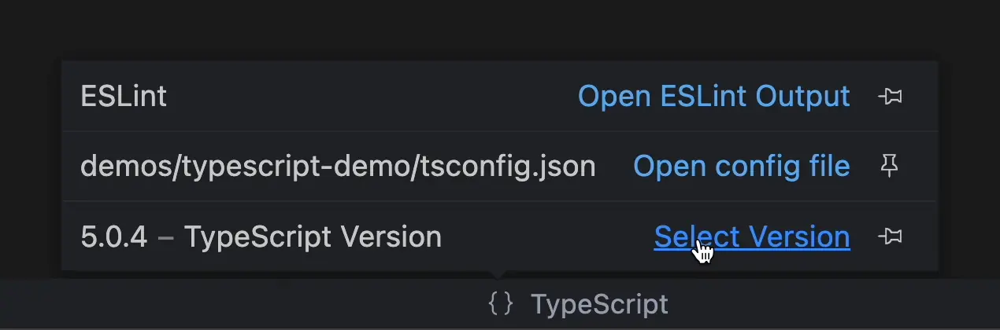

# Importable

**Importable** allows you to import files with strong typing based on import attributes (_presently import assertions_).



## Installation

```shell
npm install importable
```

```js
{
  "compilerOptions": {
    "plugins": [
      {
        "name": "importable",
        "plugins": [
          // importable plugins go here, like this:
          "@importable/yaml"
        ]
      }
    ]
  }
}
```

## Plugins

- **[Importable Document](https://github.com/importables/importable/tree/main/packages/importable-document)** allows you to import documents from different files.
- **[Importable Machine](https://github.com/importables/importable/tree/main/packages/importable-machine)** allows you to import state machines from different files.
- **[Importable YAML](https://github.com/importables/importable/tree/main/packages/importable-yaml)** allows you to import data from YAML files.

## FAQ

Still seeing a "**Cannot find module**" error after installing `importable` and the plugin for a given import?



To resolve this, switch to the workspace version of TypeScript.

In **VS Code**, this can be done by clicking on the TypeScript version number in the Status Bar.



A message box will appear asking you which version of TypeScript VS Code should use. Choose "Use Workspace Version". Once that is done, close and open your file to see the typings. That should be it.

More information about setting the workspace version of TypeScript is available in the [VS Code documentation](https://code.visualstudio.com/docs/typescript/typescript-compiling#_using-the-workspace-version-of-typescript).

## Regarding Import Assertions

Internally, **Importable** treats import assertions as if they are [import attributes](https://github.com/tc39/proposal-import-attributes),
in anticipation of the new import assertions syntax.

Once TypeScript supports import assertions, this plugin will provide an update to support the new syntax.

## License

Code original to this project is licensed under the CC0-1.0 License.
